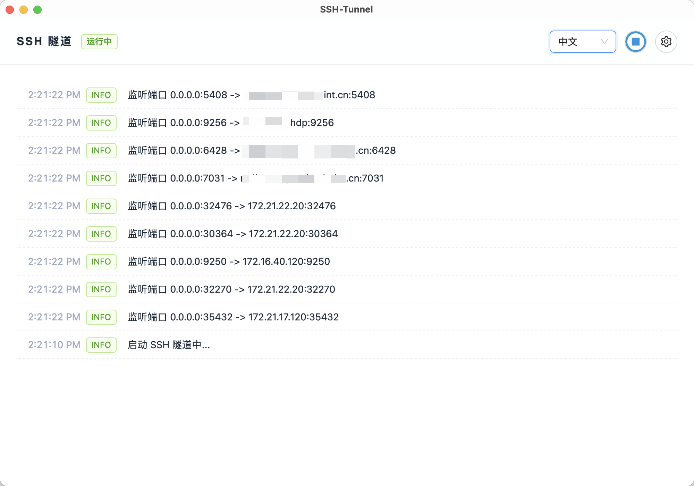
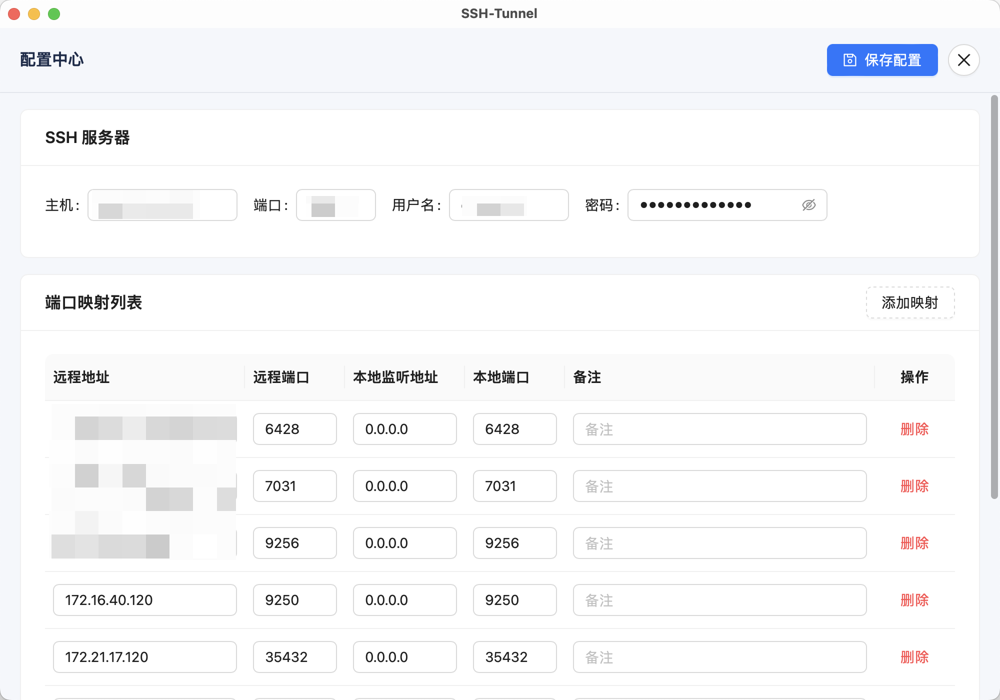

# SSH Tunnel Manager

A lightweight SSH tunnel manager built with Tauri and Vue 3. It supports multi-port forwarding, real-time logs, tray background mode, and bilingual UI (Chinese/English).

## Features

- Multi-port SSH forwarding (local bind → remote target)
- Real-time log stream
- Tray background mode (run in background + context menu)
- Bilingual UI (defaults to system language)

## Getting Started

1. Install dependencies

```bash
yarn
```

2. Run the desktop app (Tauri)

```bash
yarn tauri dev
```

> For frontend-only development: `yarn dev`

## Screenshots

### Running View



### Settings View



